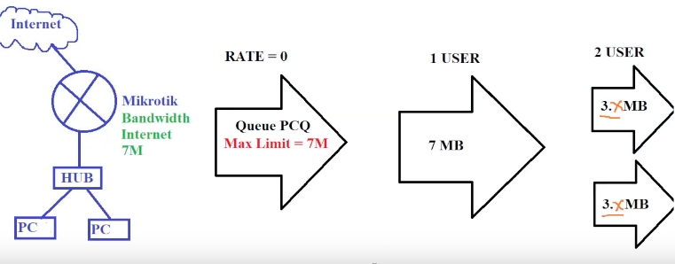
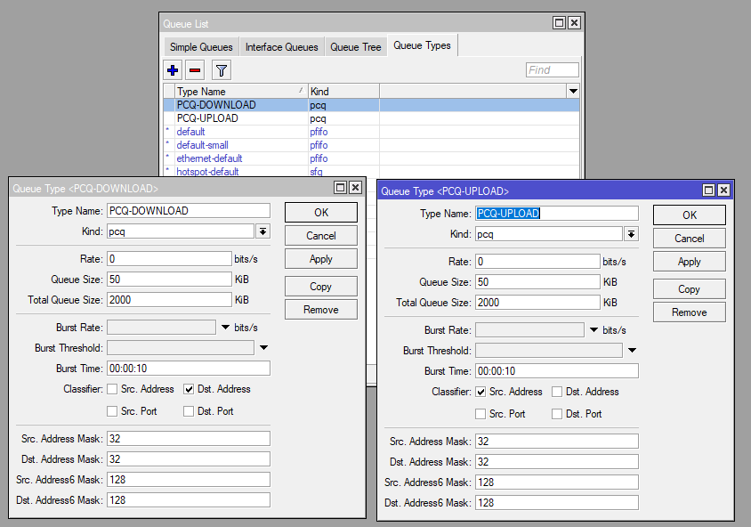
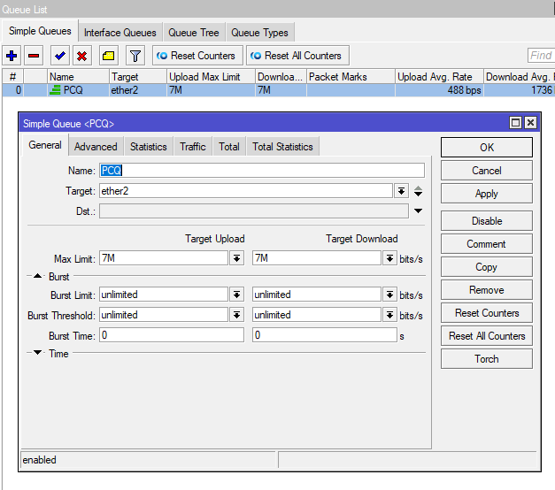
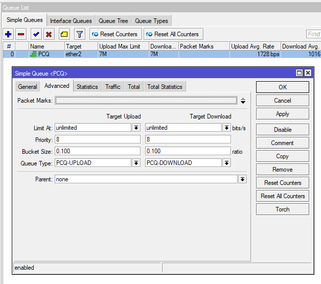

# LAB-29-PCQ-configuration-
Selasa 19 Agustus 2025  

# PCQ configuration  
  

  1. Pertama kita buat dulu queue types nya di **queue > queue types**  .  
      Buat 2, dan ubah **kind** untuk keduanya nya menjadi **pcq**  
     Aktifkan Dst Address untuk PCQ Download dan Src Address untuk PCQ Upload  
  
  3. Setelah itu kita buat simple queuenya, di **queue > simple queue**.  
     Masukan interface Target, dan masukan Limit nya sesuai topologi, yaitu 7Mbps  
  
  4. Jika sudah sekarang pergi ke tab **Advance**, masih di simple queue yang tadi. Ubah queue typenya menjadi ke queue yang telah dibuat tadi.  
  
  5. Jika sudah bisa di cek di kedua PC secara bersamaan dengan mengecek traffic, seperti mengunakan speedtest.com atau semacamnya.  

# Kesimpulan 
  Konfigurasi PCQ (Per Connection Queue) pada Mikrotik digunakan untuk melakukan pembagian bandwidth secara adil kepada setiap host. Dengan membuat queue type PCQ untuk download (berdasarkan Dst Address) dan upload (berdasarkan Src Address), lalu mengaitkannya pada simple queue dengan batasan bandwidth tertentu, setiap client akan mendapatkan jatah bandwidth yang merata sesuai jumlah pengguna aktif.  

# Sumber
  Youtube - IDN - https://www.youtube.com/watch?v=-EOTmcZ9Kmg
